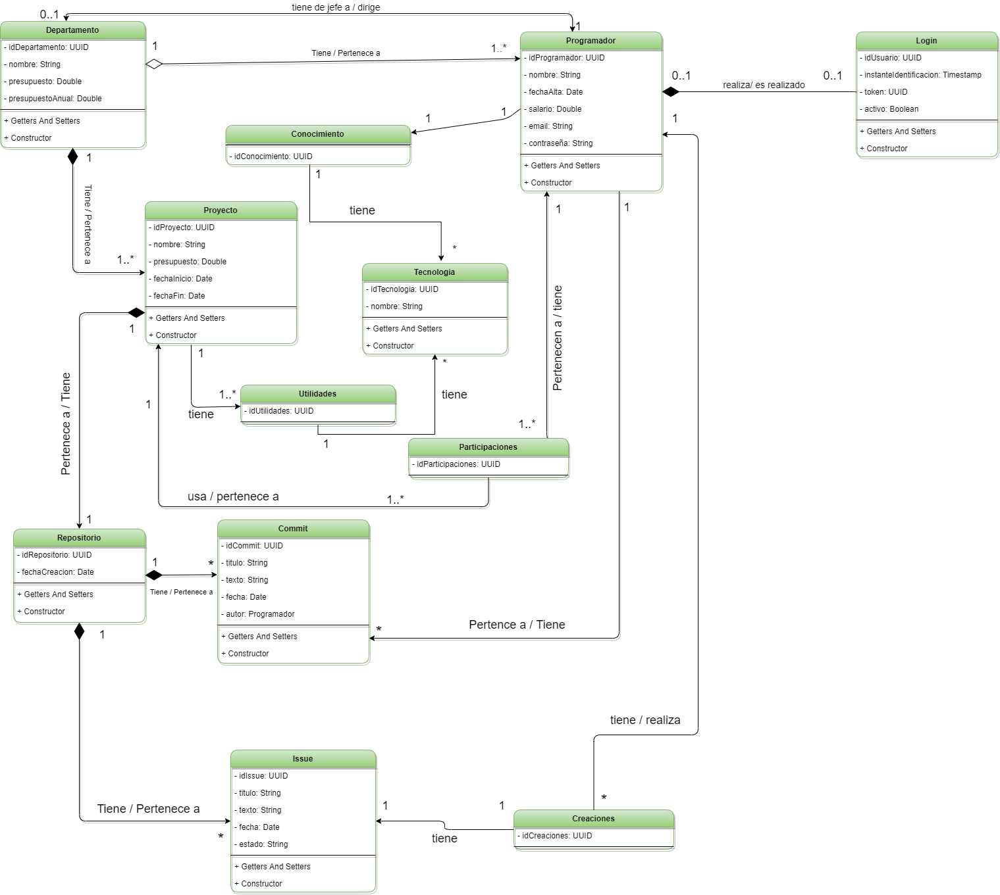

# Practica04AD Daniel Castellote y Javier González

## Descripcion
Realizaremos una implantación completa de una BBDD NoSQL (MongoDB) realizando un Mapeo a Objetos con Documentos usando Hibernate OGM y JPA. 
Nuestra practica consiste en implementar una simulación de empresa informática, en esta crearemos interrelaciones entre las entidades propuestas y realizaremos las restricciones necesarias para conseguir controlar la navegabilidad y la cardinalidad, con ello podremos realizar todas las consultas CRUD con nuestras propias restricciones; además implementaremos una opción de modelo nuevo visto en clase que es los documentos embebidos, realizaremos varios ejemplos de ello en algunas entidades.  
Por último realizaremos tests unitarios con JUnit 5 y programaremos la salida de las consultas en Json.

## Tecnologias
Hemos usado las siguientes tecnologías: 

- Java 11. 
- MongoDB como Base de datos NoSQL. 
- Docker para lanzar la base de datos. 
- Hibernate como OGM y JPA  

## Diagrama
Hemos realizado un diagrama para esquematizar toda nuestra BBDD y realizar todas las restricciones:  
; 

## Mongo Express
Estos son los datos para nuestra BBDD:  

Conectarte a  http://localhost:8081/ 
- server: localhost:27017
- user: 
- password: 
- base de datos: 
